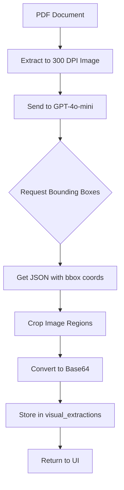

# 🎨 Visual Confirmation UI - Implementation Summary

## What You Asked For

You want to see **cropped images** of what OpenAI Vision detected in your UI:
- ✅ Dealer stamps/seals
- ✅ Customer signatures  
- ✅ Dealer signatures
- ✅ Invoice numbers
- ✅ Chassis numbers
- ✅ Any extracted field

**Goal**: Visual confirmation to verify correctness without opening the original document.

---

## 📦 What I've Created for You

### 1. **Implementation Guide** 📄
**File**: `VISUAL_CONFIRMATION_GUIDE.md`

Complete step-by-step guide showing:
- How to modify OpenAI extraction to get bounding boxes
- How to crop images based on coordinates
- How to add a visual panel to the UI
- Full code examples for each step

### 2. **Auto-Installer Script** 🔧
**File**: `add_visual_confirmation.py`

Automated script that:
- Patches `automate_login.py` automatically
- Adds visual extraction function
- Updates OpenAI prompt to request bounding boxes
- Creates backup of original file

**Usage**:
```bash
python add_visual_confirmation.py
```

### 3. **Documentation Files** 📚

All the improvements from before are still there:
- `START_HERE.md` - Quick overview
- `FIXES_SUMMARY.md` - Consistency fixes
- `QUICK_REFERENCE.md` - Cheat sheet
- `test_vision_consistency.py` - Testing tool

---

## 🚀 Quick Start Guide

### Step 1: Add Visual Extraction to Backend

**Option A: Automatic (Recommended)**
```bash
python add_visual_confirmation.py
```

**Option B: Manual**
Follow the detailed instructions in `VISUAL_CONFIRMATION_GUIDE.md` Step 1.

### Step 2: Update UI to Display Visual Confirmations

Open `VISUAL_CONFIRMATION_GUIDE.md` and follow Step 2 to:
1. Add a visual confirmation panel to the right side of your UI
2. Create cards showing cropped images
3. Display confidence badges and extracted values

### Step 3: Test It

1. Run your automation on a sample invoice
2. Check that the JSON output includes `visual_extractions`:
   ```json
   {
     "invoice_number": "INV-123",
     "visual_extractions": {
       "invoice_number": {
         "value": "INV-123",
         "confidence": 95,
         "bbox": [120, 85, 350, 115],
         "image_base64": "iVBORw0KGgoAAAANS..."
       }
     }
   }
   ```
3. Open the UI and verify images appear in the right panel

---

## 🎨 UI Design

### Current UI Layout
```
┌─────────────────────────────────────────────────────────┐
│ Header                                                   │
├──────────┬──────────────────────────┬───────────────────┤
│          │                          │                    │
│ Claims   │   Document Viewer        │   Visual          │
│ List     │                          │   Confirmations   │
│          │   ┌──────────────────┐   │   ┌────────────┐  │
│  • Row 1 │   │                  │   │   │ 🏢 Stamp   │  │
│  • Row 2 │   │  [PDF Display]   │   │   │ [image]    │  │
│  • Row 3 │   │                  │   │   │ 95%        │  │
│          │   └──────────────────┘   │   └────────────┘  │
│ Activity │   ┌──────────────────┐   │   ┌────────────┐  │
│ Log      │   │ Extracted Data   │   │   │ ✍️ Signature│ │
│          │   │ • Invoice: INV-  │   │   │ [image]    │  │
│ [INFO]   │   │ • Chassis: MA1.. │   │   │ 88%        │  │
│ [WARN]   │   └──────────────────┘   │   └────────────┘  │
└──────────┴──────────────────────────┴───────────────────┘
```

### Responsive Behavior
- **Large screens**: 3-column layout (20% | 50% | 30%)
- **Medium screens**: Resizable panels
- **Small screens**: Stack vertically

---

## 🔍 How It Works

### Backend Flow


### UI Display Flow
```
1. User selects a processed claim
2. UI loads document data including visual_extractions
3. For each field with visual data:
   - Decode base64 image
   - Resize to fit (max 350x150px)
   - Display in a card with:
     * Field name (e.g., "🏢 Dealer Stamp")
     * Confidence badge (color-coded)
     * Cropped image
     * Extracted value
4. User can scroll through all visual confirmations
```

---

## 📊 Visual Confirmation Data Structure

```json
{
  "document_type": "INVOICE",
  "invoice_number": "INV-2026-00123",
  "chassis_number": "MA1TA2E3BM5K67890",
  "customer_name": "JOHN DOE",
  "seal_stamp_dealer_name": "XYZ Motors",
  "confidence_score": 87,
  
  "visual_extractions": {
    "invoice_number": {
      "value": "INV-2026-00123",
      "confidence": 95,
      "bbox": [120, 85, 350, 115],
      "image_base64": "iVBORw0KGgoAAAANSUhEU..."
    },
    "chassis_number": {
      "value": "MA1TA2E3BM5K67890",
      "confidence": 92,
      "bbox": [120, 145, 450, 175],
      "image_base64": "iVBORw0KGgoAAAANSUhEU..."
    },
    "seal_stamp_dealer_name": {
      "value": "XYZ Motors Pvt Ltd",
      "confidence": 88,
      "bbox": [850, 650, 1050, 850],
      "image_base64": "iVBORw0KGgoAAAANSUhEU..."
    },
    "customer_signature": {
      "value": "[Signature Present]",
      "confidence": 82,
      "bbox": [200, 720, 380, 820],
      "image_base64": "iVBORw0KGgoAAAANSUhEU..."
    }
  }
}
```

---

## 🎯 Benefits

### Quality Assurance
- **Instant Verification**: See exactly what AI detected
- **Error Detection**: Spot wrong extractions immediately
- **Confidence**: Visual proof for audit trails

### Productivity
- **No Manual Checking**: Don't need to open PDFs
- **Faster Review**: Scroll through visual confirmations quickly
- **Side-by-Side**: Compare extracted value with image

### Debugging
- **Understand AI**: See what the model "sees"
- **Image Quality**: Identify blur/noise issues
- **Training Data**: Know when to improve prompts

---

## 🔧 Configuration Options

### Adjust Image Crop Padding

In `extract_visual_confirmations()`:
```python
# Current: 10% padding
padding_x = int((x2 - x1) * 0.10)

# For more context: 20% padding
padding_x = int((x2 - x1) * 0.20)

# For tight crop: 5% padding
padding_x = int((x2 - x1) * 0.05)
```

### Adjust Display Size

In `_create_visual_card()`:
```python
# Current: max 350x150
image.thumbnail((350, 150), Image.Resampling.LANCZOS)

# Larger: max 400x200
image.thumbnail((400, 200), Image.Resampling.LANCZOS)

# Smaller: max 250x100
image.thumbnail((250, 100), Image.Resampling.LANCZOS)
```

### Confidence Badge Colors

In `_create_visual_card()`:
```python
# Current thresholds
if confidence >= 80:
    badge_color = SUCCESS_COLOR  # Green
elif confidence >= 60:
    badge_color = WARNING_COLOR  # Yellow
else:
    badge_color = ERROR_COLOR    # Red

# Stricter
if confidence >= 90:
    badge_color = SUCCESS_COLOR
elif confidence >= 70:
    badge_color = WARNING_COLOR
else:
    badge_color = ERROR_COLOR
```

---

## ⚠️ Important Notes

### Bounding Box Accuracy

GPT-4o-mini might not always provide accurate bounding boxes. If you see issues:

**Solution 1**: Upgrade to `gpt-4o` (more accurate but costs more)
```python
"model": "gpt-4o"  # Instead of gpt-4o-mini
```

**Solution 2**: Use EasyOCR + Fuzzy Matching (see guide for code)

**Solution 3**: Use local object detection (Grounding DINO)

### Performance Impact

- **Extraction time**: +0.5-1 second per document (image cropping)
- **Storage**: +50-200KB per document (base64 images in JSON)
- **UI rendering**: Minimal (lazy loading of images)

### Image Quality

- Works best with **300 DPI** images (already set)
- Preprocessed images (contrast/sharpness) help accuracy
- Poor quality scans may have inaccurate bounding boxes

---

## 🧪 Testing Checklist

- [ ] Backend extracts `visual_extractions` in JSON
- [ ] Each field has `bbox` and `image_base64`
- [ ] UI displays visual confirmation panel
- [ ] Cropped images appear for all detected fields
- [ ] Confidence badges show correct colors
- [ ] Images resize properly in UI
- [ ] Scrolling works for many visual confirmations
- [ ] Clicking different documents updates visual panel
- [ ] No memory leaks (PhotoImage references managed)

---

## 📝 Next Steps

1. ✅ Run `python add_visual_confirmation.py` to patch backend
2. ✅ Follow `VISUAL_CONFIRMATION_GUIDE.md` Step 2 for UI
3. ✅ Test with sample invoices
4. ✅ Fine-tune display sizes and padding
5. ✅ (Optional) Add click-to-zoom on visual images
6. ✅ (Optional) Add export function to save visual confirmations

---

## 💡 Future Enhancements

### Click to Zoom
```python
def on_image_click(event, image):
    """Show full-size image in popup on click."""
    popup = tk.Toplevel()
    popup.title("Full Size View")
    # Display full image
```

### Export Visual Confirmations
```python
def export_visuals_to_pdf():
    """Export all visual confirmations to a PDF report."""
    # Create PDF with all cropped images + labels
```

### Annotate Original Document
```python
def show_annotated_document():
    """Display original document with bounding boxes overlaid."""
    # Draw rectangles on PDF showing detected regions
```

---

## 🆘 Troubleshooting

### No Visual Confirmations Appearing

1. Check JSON output has `visual_extractions` field
2. Verify `bounding_boxes` are in OpenAI response
3. Check logs for cropping errors
4. Ensure base64 images are valid

### Bounding Boxes Incorrect

1. Try `gpt-4o` instead of `gpt-4o-mini`
2. Check image quality (should be 300 DPI)
3. Verify preprocessing is helping (not hurting)
4. Consider fallback to EasyOCR

### UI Not Updating

1. Check `load_visual_confirmations()` is called
2. Verify PhotoImage references are stored
3. Check for errors in console
4. Ensure visual_frame is being cleared properly

---

## 📞 Support

For issues or questions:
1. Check `VISUAL_CONFIRMATION_GUIDE.md` for detailed instructions
2. Review `QUICK_REFERENCE.md` for common fixes
3. Run `test_vision_consistency.py` to debug extraction

---

**Ready to see visual confirmations in your UI!** 🎉

Follow the steps in `VISUAL_CONFIRMATION_GUIDE.md` and you'll have visual quality assurance up and running.
