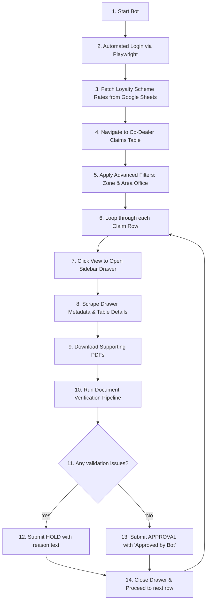
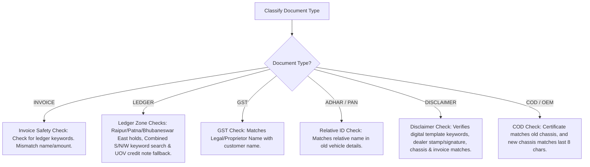

# Co-Dealer Claims Automation & Validation System: Project Reference Manual

This manual provides an A-to-Z breakdown of the **Co-Dealer Claims Automation & Validation System**, explaining what the project does, where the code logic is located, why specific rules exist, and how documents are scanned and verified. 

---

## 1. System Overview & Workflow

The system is designed to automate the process of logging into the Mahindra Dealer Rise portal, navigating to co-dealer claims, extracting claim metadata, downloading supporting documents (PDFs), and validating those documents against a complex set of business rules. Based on validation results, the bot either **Approves** the claim or places it on **Hold** with detailed reasoning.

---

## 2. Core Features & Capabilities

1. **Automated Browser Control**: Utilizes Playwright to control a Chromium browser, reuse existing Microsoft Edge user profiles to bypass cookie walls, and handle human-in-the-loop OTP verification.
2. **Google Sheets Integration**: Fetches real-time loyalty/scrappage expected rates by exporting a live Google Sheet to CSV and parsing it in-memory.
3. **Hybrid PDF Text Extraction**: Uses digital text extraction (via `PyMuPDF` or `pypdf`) and falls back to spatial optical character recognition (OCR via `EasyOCR`) if the text layer is corrupt or missing (e.g., scanned images).
4. **Computer Vision-Based Stamp & Signature Detection**: Employs `OpenCV` to detect customer signatures and blue/violet ink dealer stamps, verifying the stamp text against the expected dealership name.
5. **Dynamic Document Classification**: Automatically classifies PDFs as an Invoice, Ledger, Aadhaar, PAN, Disclaimer, GST Registration, or Certificate of Deposit based on filename keywords and OCR content checks.
6. **Robust Fuzzy Matching**: Uses `rapidfuzz` to evaluate similarity scores (e.g., $\ge 80\%$) when matching names, chassis numbers, dates, and vehicle models between dashboard details and document text.

---

## 3. Step-by-Step Logic Breakdown

### Step 1: Browser Initialization & Edge Profiling
* **Where**: [automate_login.py](file:///c:/Users/admin/Desktop/robbinmahindra/automate_login.py) $\to$ `check_and_close_running_edge()`, `main()`
* **What**: Detects if Microsoft Edge is running (to release file locks), launches Playwright using the local Edge user data profile, and opens the target dealer rise portal.
* **Why**: Reusing user profiles maintains login sessions and keeps browsing patterns organic.
* **How**: Checks Windows process lists using `taskkill` if needed, then starts Playwright with `launch_persistent_context`.

### Step 2: Google Sheets Rate Sync
* **Where**: [automate_login.py](file:///c:/Users/admin/Desktop/robbinmahindra/automate_login.py) $\to$ `fetch_google_sheet_data()`, `find_matching_contribution()`
* **What**: Connects to the M&M Contribution Google Sheet URL, exports it to CSV, and populates expected rate lookup tables in-memory.
* **Why**: Bypasses hardcoded files like `scheme_data.txt` and allows immediate, live scheme rate updates by business users.
* **How**: Requests the export URL via standard HTTP requests and loads them into lists of dictionaries, matching rates by vehicle model and city.

### Step 3: Metadata Scraping & PDF Downloading
* **Where**: [automate_login.py](file:///c:/Users/admin/Desktop/robbinmahindra/automate_login.py) $\to$ `parse_drawer_details_table()`, `download_supporting_documents()`
* **What**: Clicks on claim rows, opens the sidebar drawer, extracts dashboard claim fields (Relationship, Name, Chassis Number, Approved Amount), and downloads all uploaded PDFs to a folder named after the customer.
* **Why**: Gathers the ground truth data used to validate the physical PDF documents.
* **How**: Locates elements in the DOM using Playwright locators, handles file downloads asynchronously, and maps response headers to recover clean filenames.

### Step 4: Hybrid Document Processing (Digital Text + OCR)
* **Where**: [automate_login.py](file:///c:/Users/admin/Desktop/robbinmahindra/automate_login.py) $\to$ `extract_text_hybrid()`, `is_digital_text_corrupt_or_insufficient()`
* **What**: Reads the PDF text digitally first. If the file is scanned or the digital layer has fewer than 5 alphabetic tokens, it falls back to EasyOCR, rendering the pages as images to extract text.
* **Why**: Scanned files or low-resolution uploads frequently have corrupt digital text layers.
* **How**: Uses `fitz` (PyMuPDF) to extract text blocks. If insufficient, uses `fitz` to render a 300 DPI image, processes it with `EasyOCR`, and formats the text line-by-line.

---

## 4. Document Verification Logic (The Rules Engine)

Each downloaded document undergoes type-specific validation rules inside `verify_documents()` in [automate_login.py](file:///c:/Users/admin/Desktop/robbinmahindra/automate_login.py):

### A. Invoice Safety Check
* **What**: Ensures Invoice files do not contain ledger content.
* **Why**: Prevents dealers from uploading ledger screenshots misclassified as tax invoices.
* **How**: Checks if the text contains terms like `"STATEMENT OF ACCOUNT"`, `"LEDGER"`, or `"JOURNAL ENTRY"`. If found, a **HOLD** is triggered.

### B. Ledger Document Validations
* **What**: Validates claim bonus amounts and entries inside ledger sheets.
* **Why**: Ledger entries must show that the bonus/discount was actually credited to the customer.
* **How**:
  * **East Zone (Raipur, Patna, Bhubaneswar)**: Welcomes/Scrappage entries are mandatory. Extracted amounts must match the expected scheme rate. If missing or mismatched, claim is put on **HOLD**.
  * **South / North / West Zones (Combined)**: Scans for keywords like `"Welcome Bonus"`, `"Welcome Discount"`, `"Loyalty Bonus"`, `"Exchange"`, `"Scrappage"`, `"Green Bonus"`, and `"Scheme 18%"`. If `"Scheme 18%"` is found, the `"18%"` percentage text is cleaned to extract numbers. Matches the extracted amounts against dashboard totals (accepting with-GST or without-GST for scrappage). Holds if missing or if the amount mismatches.
  * **Welcome/Loyalty UOV Fallback**: If standard welcome discount terms are missing/mismatched in the ledger, the script scans for credit note narrations containing the prefix `"UOV"` (Used Old Vehicle) and matches its amount against the expected bonus.

### C. Relationship Document Verification
* **What**: Validates relative ID documents depending on the claim relationship type.
* **Why**: Ensures claim eligibility if the old vehicle was owned by a relative or business entity.
* **How**:
  * **Relationship = "Self"**: Document check is skipped.
  * **Relationship = "Proprietor"**: Enforces a mandatory **GST document** check. The proprietor's name in the GST document must match the customer name (similarity $\ge 80\%$). If missing or mismatched, claim is put on **HOLD**.
  * **Other Relationships (Spouse, Father, etc.)**: Enforces standard supporting relative ID checks (**Aadhaar** or **PAN**) matching the old owner's name (similarity $\ge 80\%$).

### D. Disclaimer Verification
* **What**: Verifies the Loyalty Customer Disclaimer template.
* **Why**: Disclaimer must be in the current digital format (handwritten disclaimers or old templates are put on hold).
* **How**:
  * **Format Check**: Must contain at least 5 out of 8 template keywords (`"Customer Disclaimer"`, `"confirm"`, `"welcome"`, `"dealer"`, `"vehicle"`, `"chassis"`, `"engine"`, `"invoice"`) and must **not** contain old format statements like `"solemnly affirm and declare"`.
  * **Data Field Matches**: Verifies Customer Name, Dealership Name, Welcome Bonus Amount, Chassis Number, and Invoice details against the dashboard.
  * **Stamp & Signatures**: Scans the bottom of the page using `OpenCV` to verify presence of a dealer seal (validating the company text inside the seal) and customer signatures.

### E. Certificate of Deposit (COD / OEM) Verification
* **What**: Validates ELV (End-of-Life Vehicle) certificates.
* **Why**: Confirms the old vehicle was legally scrapped and links it to the new purchase.
* **How**:
  * **Old Vehicle Match**: The Certificate of Deposit ID must match the old chassis number in the dashboard.
  * **New Vehicle Match**: The new chassis number mentioned in the certificate columns must have its **last 8 characters** match the new vehicle chassis number from the claim details.

---

## 5. Decision Submission Workflow

Once the verification pipeline finishes, it returns a list of issues:
* **Issues List is Empty (APPROVED)**:
  * Bot selects the **Approve** radio button.
  * Inputs `"APPROVED BY BOT"` in the remarks textarea.
  * Clicks submit to process the approval.
* **Issues List contains Errors (HOLD)**:
  * Bot selects the **Hold** radio button.
  * Concatenates all validation error strings (e.g. `"[Ledger]: Welcome Bonus amount mismatch", "[GST]: Name mismatch"`).
  * Inputs these messages in the remarks textarea.
  * Clicks submit to put the claim on hold.

---

## 6. Developer Diagnostic Tools & Scripts

Diagnostic utility scripts reside in the [scratch/](file:///c:/Users/admin/Desktop/robbinmahindra/scratch) directory for offline debugging:
* [test_relationship_validations.py](file:///c:/Users/admin/Desktop/robbinmahindra/scratch/test_relationship_validations.py): Validates document type classification (GST, Aadhaar, PAN) and relationship rules (Self, Proprietor, Relative) with offline mocks.
* [test_ledger_validations.py](file:///c:/Users/admin/Desktop/robbinmahindra/scratch/test_ledger_validations.py): Diagnostic test script simulating Raipur, Patna, South, North, and West ledger validation rules.
* [test_final_disclaimer_logic.py](file:///c:/Users/admin/Desktop/robbinmahindra/scratch/test_final_disclaimer_logic.py): Validates digital template layout checks and EasyOCR fallbacks on disclaimer formats.
* [test_cod_chassis_validation.py](file:///c:/Users/admin/Desktop/robbinmahindra/scratch/test_cod_chassis_validation.py): Tests end-to-end matching of Certificates of Deposit (both old chassis registration and new vehicle columns).
* [inspect_stamp_color.py](file:///c:/Users/admin/Desktop/robbinmahindra/scratch/inspect_stamp_color.py): Script to test OpenCV HSV values and extract blue/violet color ranges for seal validation.
